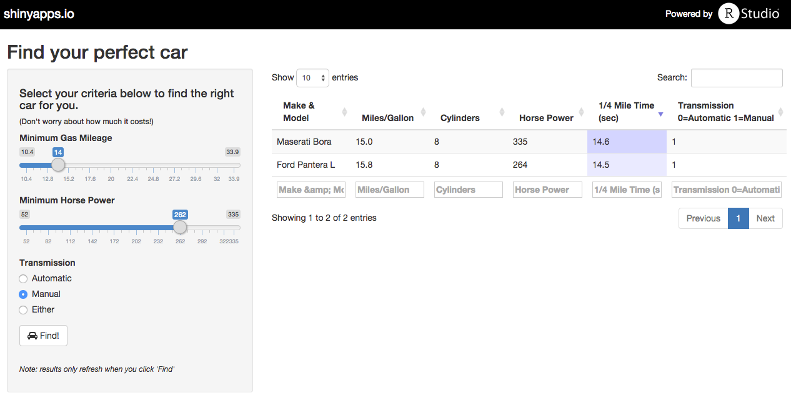

<style>
.author {
  color: #13daec;
}
.reveal ul {
  margin-bottom: 16px;
}
.reveal ul ul {
  margin-bottom: 12px;
}
.reveal ul li {
  margin-bottom: 12px;
  margin-top: 12px;
}
.reveal ul ul li {
  margin-bottom: 12px;
  margin-top: 12px;
}
</style>

## Car Finder

Course project for Coursera's <br>
<i>Developing Data Products</i>
<br>
<br>
<div class="author">
  <p><a href="https://github.com/jrbardin">Jess Bardin</a></p>
  <p>Senior Analytics Developer</p>
  <p><a href="http://www.elicitinsights.com">www.elicitinsights.com</a></p>
</div>

--- .class #id 

## Tring to find the perfect car?

* There are plenty of websites that offer car searches
* But nothing as sophisticated as what you'll see in a moment
* What if you could specify specific requirements like the following:
  * gas mileage
  * horse power
  * transmission
* And then see a list of matching cars in seconds

--- .class #id

## Well, there's a Shiny app for that

https://bardin.shinyapps.io/course_project/


--- .class #id 

## Using the world's most comprehensive automobile database


```r
head(mtcars)
```

```
##                    mpg cyl disp  hp drat    wt  qsec vs am gear carb
## Mazda RX4         21.0   6  160 110 3.90 2.620 16.46  0  1    4    4
## Mazda RX4 Wag     21.0   6  160 110 3.90 2.875 17.02  0  1    4    4
## Datsun 710        22.8   4  108  93 3.85 2.320 18.61  1  1    4    1
## Hornet 4 Drive    21.4   6  258 110 3.08 3.215 19.44  1  0    3    1
## Hornet Sportabout 18.7   8  360 175 3.15 3.440 17.02  0  0    3    2
## Valiant           18.1   6  225 105 2.76 3.460 20.22  1  0    3    1
```

--- .class #id 

## Using the app is simple

* Specify your minimum gas mileage requirement
* Specify your minimum horse power requirement
* Select the type of transmission you want
* (Obviously these are the only important factors for a car search)
* And hit the <i>Find!</i> button

--- .class #id 

## And you have results in seconds



Maserati Bora for me
<br>


